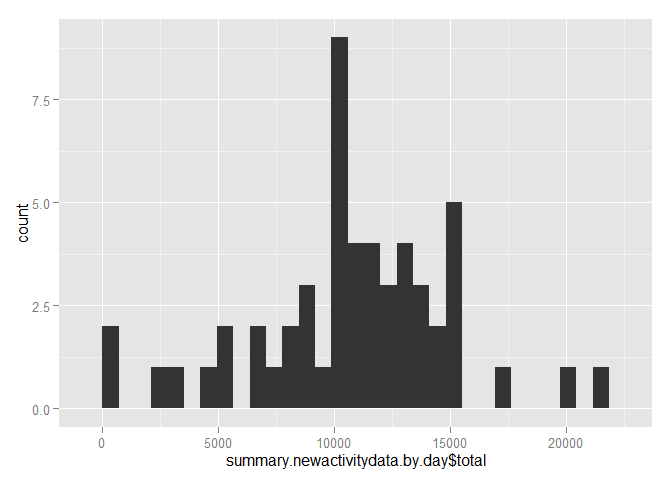
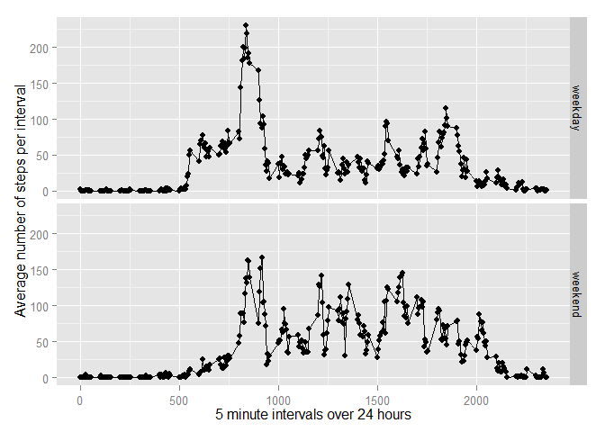

# Reproducible Research: Peer Assessment 1
Troy Rose <troyjrose@gmail.com>  


## Loading and preprocessing the data

```r
library(dplyr)
```

```
## 
## Attaching package: 'dplyr'
## 
## The following objects are masked from 'package:stats':
## 
##     filter, lag
## 
## The following objects are masked from 'package:base':
## 
##     intersect, setdiff, setequal, union
```

```r
library(ggplot2)
activitydata<-read.csv("C:\\Users\\troy\\Desktop\\repdata-data-activity\\activity.csv")
# translate time interval to %H:%M
translate<-function(x){
    return(paste(sprintf("%02d", trunc(x / 100)),":", sprintf("%02d", x %% 100), sep=""))
}
# apply to interval to create "time" field
activitydata$time<-lapply(activitydata$interval, translate)

# create datetime field
activitydata$datetime<-as.POSIXct(strptime(paste(activitydata$date, " ", activitydata$time), format = "%Y-%m-%d %H:%M"))
```


## What is mean total number of steps taken per day?

```r
activitydata.by.day<-group_by(activitydata, date)
summary.activitydata.by.day<-summarise(activitydata.by.day, total = sum(steps))
qplot(summary.activitydata.by.day$total, geom="histogram")
```

```
## stat_bin: binwidth defaulted to range/30. Use 'binwidth = x' to adjust this.
```

 

```r
meansteps<-mean(summary.activitydata.by.day$total, na.rm=TRUE)
mediansteps<-median(summary.activitydata.by.day$total, na.rm=TRUE)
```

The mean steps per day is 1.0766 &times; 10<sup>4</sup>.

The median steps per day is 10765.

## What is the average daily activity pattern?

```r
library(ggplot2)
activitydata.by.interval<-group_by(activitydata,interval)
summary.activitydata.by.interval<-summarise(activitydata.by.interval, mean = mean(steps, na.rm=TRUE))
qplot(summary.activitydata.by.interval$interval,summary.activitydata.by.interval$mean,ylab="Average number of steps per interval", xlab="5 minute intervals over 24 hours") + geom_line(aes(y = summary.activitydata.by.interval$mean), size = .5, alpha = 1)
```

 

```r
maxmeansteps<-max(summary.activitydata.by.interval$mean, na.rm=TRUE)
intmaxmeansteps<-filter(summary.activitydata.by.interval, mean==maxmeansteps)$interval
```

The maximun of the mean total steps per day is 206.1698.

The 5-minute interval that, on average, contains the maximum number of steps  is 835.

## Inputing missing values

```r
totalnas<-length(activitydata$steps[is.na(activitydata$steps)])

fillnas<-function(x) {
        if(is.na(x$steps)) {
                trunc(filter(summary.activitydata.by.interval, interval==x$interval)$mean)
        } else {
                return(x$steps)
        }
}
activitydata$stepsfilled<-apply(activitydata, c(1),fillnas)

newactivitydata.by.day<-group_by(activitydata, date)
summary.newactivitydata.by.day<-summarise(newactivitydata.by.day, total = sum(steps))
hist(summary.newactivitydata.by.day$total,  main = "Histogram of steps per day")
```

 

```r
newmeansteps<-mean(summary.newactivitydata.by.day$total, na.rm=TRUE)
newmediansteps<-median(summary.newactivitydata.by.day$total, na.rm=TRUE)
```
Number of NAs for steps is 2304.

My strategy for sumplementing missing values for steps is:

1. For all missing values:

        1. Replace the missing value with the average for that interval across all days truncated to a whole integer.
        
The new steps filled in are stored in activitydata$stepsfilled.

The mean steps per day is 1.0766 &times; 10<sup>4</sup>.

The median steps per day is 10765.

It does not appear that filling in the missing values of steps made very much difference to the overall mean and median steps per day.

## Are there differences in activity patterns between weekdays and weekends?


```r
# create new factor with two levels for days of week in weekend and weekday
activitydata$dayofweek<-factor(c("weekend", "weekday", NA))

# fill in values for weekends and weekdays
activitydata[!(weekdays(as.Date(activitydata$date)) %in% c('Saturday','Sunday')),]$dayofweek<-as.factor("weekday")
activitydata[(weekdays(as.Date(activitydata$date)) %in% c('Saturday','Sunday')),]$dayofweek<-as.factor("weekend")

# group by day of week and interval
activitydata.by.dayofweek<-group_by(activitydata, dayofweek, interval)

# summarise data getting average of steps per day for each weekend and weekday
summary.activitydata.by.dayofweek<-summarise(activitydata.by.dayofweek, mean = mean(stepsfilled))

# plot data
qplot(interval, mean, data=summary.activitydata.by.dayofweek, ylab="Average number of steps per interval", xlab="5 minute intervals over 24 hours",facets = dayofweek ~ . ) + geom_line(aes(y = summary.activitydata.by.dayofweek$mean), size = .5, alpha = 1)
```

 

Yes, it appears that on weekends, there is less early morning activity, with peak activity occuring at around 8:00am, with very little activity prior to 8:00am (it appears that people like to sleep in on weekends).

This is different to the weekdays where morning activity starts at around 5:00am and peaks at around 9:00am. 
